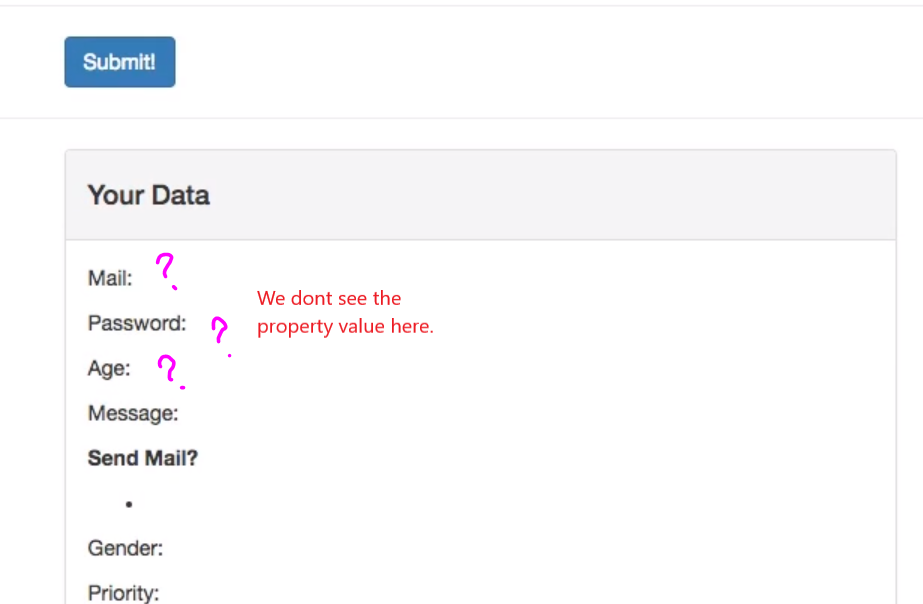

# S11 | Handling User Input with Forms

---

Just test

# S11 | A Basic `<input>` Form Binding

---

Form - Compolaint

View your data

-   Later - This data should be viewed on submit

template

email

Output

# S11 | Grouping Data and Pre-Populating Inputs

---

# S11 | Modifying User Input with Input Modifiers

---

Values updated on each keystroke

`v-model.lazy`

-   I can add the lazy modifier with .lazy,
-   what this will do is that behind the scenes, it will now not listen to the `input` event,so whenever we type something, whenever we enter something new
-   but to the `change` event which is only
    fired once we click somewhere else, once we leave that input.

Other modifiers

1. trim
2. number

# S11 | Binding `<textarea>` and Saving Line Breaks

---

How should we behave with a text area like this one

Interpolation between texttarea does not work

`white-space: pre` - To keep the multiline string - CSS

# S11 | Using Checkboxes and Saving Data in Arrays

---

Objective

I want to have these checkboxes here hooked up so that we can see if these are checked with true or false and then thereafter, we'll have a look at radio buttons and a dropdown here.

Checkboxes

-   We Want to store the checked values in an array

sendMail - array

Binding 2 inputs to the same model

-   vue js will automatically Merge the value of these checkboxes into the single array sendMail

Seeing the values in the sendMail - looping

Output

# S11 | Using Radio Buttons

---

So right now it's not working correctly.So we want to ensure that we can only select one and then that we store the value of the selected radio button in some property, let's use vuejs to help us there.

Data property

Template - radio button

Binding to the property

-   binding to a single property
-   vue js now knows that these radio buttons belongs to the same group
-   so now we can only select one option

Single option

Output

# S11 | Handling Dropdowns with `<select> and <option>`

---

Dropdown

-   I want to add options dynamically. Thats why its empty

**Objectives**
I want to do two things, I of course want to use vuejs to get the value but I also want vuejs to populate this select, this dropdown with options. You see right now,

Data property - priiorities

Looping

Output

Selecting a default option

How do I bind the selected option

Why High is selected by default ?

-   this is decided by the model we bind to.
-   selected only works when we are not prepopulting use vue model

Remove the selecedted property

Output

# S11 | What v-model does and How to Create a Custom Control

---

**Objective**
I want to build a little switch which I can toggle between on and off and to do this, I will build my own component which has this logic in it,

**v-model - behind the scenes**
How does the v-model works behind the scene
Lets do this manually

-   Now that we know how v-model works behind the scenes, we know how our own component has to work to be able to be usable with v-model,
-   it has to have a prop named value so that v-model is able to pass a value into our component
-   and it has to emit an event called input to allow v-model to react to that. Well with these two information pieces, we can create our own component,

Switch - Our Own Component

# S11 | Creating a Custom Control (Input)

---

## Setup

Switch.vue

App.vue

## Lets make it work

remove `IsOn`

Use the value prop passed from outside

-   the value prop is passsed from outside but now its changable from inside.

Now we also need to submit an event

-   on click call switched
-   emit an event from the switcherd method
-   the event must be `input` so that v-model is able to function properly

Output the dataswitch property which is bound to the custom component

-   we build our own control

# S11 | Submitting a Form

---

Prevent the default behaviour of a button in a form

-   prevent modifier.
-   prevent request being sent to the server
-   we want to handle it through vuejs

-   use this property to show or not show the data panel

`v-if`

-   we can handle our data in the submitted method

# S11 | Assignment 9: Time to Practice - Forms

---

